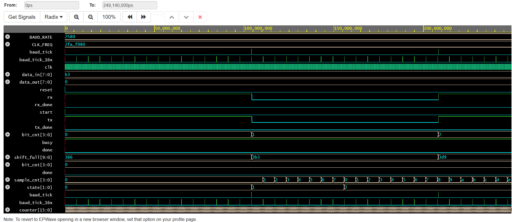

# UART Controller Design and Verification (Verilog RTL)

## Overview

This project implements a Universal Asynchronous Receiver Transmitter (UART) controller in Verilog RTL. The design includes a baud rate generator, UART transmitter, UART receiver with 16x oversampling, top-level integration, and a self-checking testbench.

The project was developed to understand serial communication protocols, FSM design, shift-register based data transmission, and RTL verification techniques.

---

## Features

- UART Transmitter (TX)
- UART Receiver (RX)
- Baud Rate Generator
- 16x Oversampling Receiver
- Start Bit Detection
- Stop Bit Verification
- LSB-First Data Transmission
- FSM-Based UART Reception
- Loopback Verification
- Self-Checking Testbench

---

## Project Architecture

UART Controller
│
├── Baud Generator
│ ├── baud_tick
│ └── baud_tick_16x
│
├── UART Transmitter
│ ├── Start Bit
│ ├── 8 Data Bits
│ └── Stop Bit
│
├── UART Receiver
│ ├── Start Detection
│ ├── 16x Oversampling
│ ├── Data Reception
│ └── Stop Verification
│
└── UART Top Module

---

## RTL Modules

### baud_gen.v

Generates:

- baud_tick (9600 baud)
- baud_tick_16x (oversampling clock)

Used by both transmitter and receiver.

### uart_tx.v

Implements UART transmission.

Functions:

- Frame generation
- Shift register operation
- LSB-first transmission
- Transmission complete indication

### uart_rx.v

Implements UART reception.

Functions:

- Start bit detection
- 16x oversampling
- Data reconstruction
- Stop bit verification
- Receive complete indication

### uart_top.v

Top-level integration module connecting:

- Baud Generator
- UART TX
- UART RX

Loopback connection:

```verilog
assign rx = tx;
```

Used for functional verification.

---

## Verification

A self-checking testbench was developed to verify UART communication.

Test Cases:

- Transmit 0xB3
- Receive 0xB3
- Verify TX completion
- Verify RX completion
- Check received data matches transmitted data

PASS/FAIL messages are automatically generated.

---

## Simulation Waveform



The waveform demonstrates:

- Start bit transmission
- Data bit shifting
- Stop bit transmission
- Receiver sampling
- Successful UART loopback communication

---

## Tools Used

- Verilog HDL
- EDA Playground
- Icarus Verilog
- EPWave

---

## Skills Demonstrated

- Verilog RTL Design
- Finite State Machine (FSM)
- UART Protocol
- Digital Logic Design
- Shift Registers
- Serial Communication
- Functional Verification
- Waveform Analysis
- Debugging and Validation

---

## Future Improvements

- UART Parity Support
- Configurable Data Length
- Configurable Baud Rate
- FIFO-Based TX/RX Buffers
- APB Peripheral Integration

---

## Author

Arjun Prabhu S

Electronics Engineering (VLSI Design and Technology)

Karpagam College of Engineering

GitHub:
https://github.com/arjun10102006
